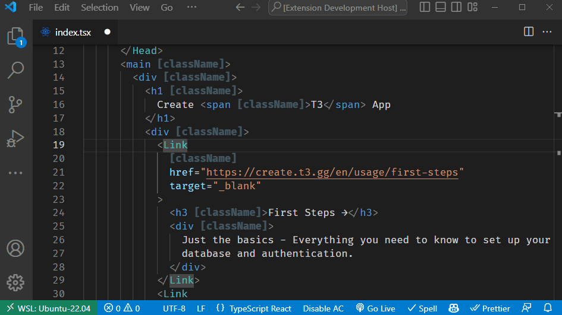
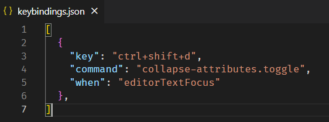

## Attributes Collapse

The extension is designed to automatically collapse className and class attributes in TSX, JSX, and HTML files to a single line, reducing the length of lines and making the code easier to read and navigate. This idea was inspired by the frustration that many developers using CSS frameworks like Tailwind CSS have expressed about the length of class names in their code.

## Demo



## Install

[Visual Studio Marketplace](https://marketplace.visualstudio.com/items?itemName=AKROSS.attributes-collapse) or search for `akross.attributes-collapse` in VS Code Extension Manager

## Configuration

`attributes-collapse.attributes: string[]`

Default value:

```
className class tw
```

`attributes-collapse.enabledLanguageIds: string[]`

Default value:

```
typescriptreact
javascriptreact
html
typescript
javascript
vue-html
vue
php
markdown
coffeescript
razor
ruby
rust
```

You can use command `attributes-collapse.toggle` to
[set a key binding](https://code.visualstudio.com/docs/getstarted/keybindings) to toggle the collapse.

e.g.



## Running the Extension

- Run `npm install` in terminal to install dependencies
- Run the `Run Extension` target in the Debug View. This will:
  - Start a task `npm: watch` to compile the code
  - Run the extension in a new VS Code window

## Issues

If you find a bug in this project, we encourage you to file an issue on our [GitHub repository](https://github.com/akr-oss/attributes-collapse).
